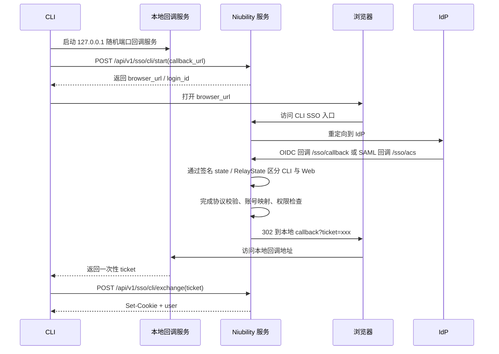

# SSO 登录设计方案

## 概述

本文档描述 Niubility CLI 如何处理 SSO（单点登录）认证。SSO 允许用户通过企业身份提供商（IdP）进行身份验证，而不是使用用户名/密码。

## 支持的 SSO 协议

- **OIDC** (OpenID Connect)：基于 OAuth 2.0 的身份层
- **SAML 2.0**：企业级单点登录标准

## 推荐方案：服务端中转 + 本地回调

### 原理

CLI 在本地启动一个临时的 HTTP 服务器，但它不直接承接 IdP 回调，也不直接处理 OIDC / SAML 协议参数。

推荐流程是：

- 本地 CLI 先向 Niubility 服务登记一次 CLI 登录请求，并提交本地回调地址
- 浏览器只和 Niubility 服务、IdP 交互
- IdP 完成认证后统一回调到 Niubility 服务现有的 Web SSO 回调地址
- Niubility 服务完成协议解析、账号映射与业务校验后，再把一次性 `ticket` 重定向到本地回调地址
- CLI 再用该 `ticket` 向 Niubility 服务换取会话 Cookie

这样 CLI 只依赖 Niubility 自己定义的稳定协议，不直接耦合 IdP 协议细节。

### 流程图



### 为什么这样更合理

- **协议边界更清晰**：OIDC / SAML 差异、state 管理、断言校验、回调地址策略都收敛在服务端
- **CLI 更稳定**：未来业务要加组织校验、绑定逻辑、登录前置检查，只需改 CLI 与 Niubility 服务之间的协议
- **安全性更好**：CLI 本地只接收一次性 `ticket`，不直接暴露 IdP 协议参数与回调语义
- **更利于复用现有 Web SSO 能力**：CLI 与 Web 共用现有 `/sso/callback`、`/sso/acs`，无需为 CLI 单独申请新的 IdP 回调地址
- **更容易演进**：后续若增加审计、审批、风控、租户映射，主要改服务端而不是重做 CLI 流程

### 详细步骤

1. **启动本地服务器**
   - CLI 启动一个临时的 HTTP 服务器
   - 监听 `127.0.0.1:0`（系统分配随机端口）
   - 注册 `/callback` 路径用于接收回调

2. **登记 CLI 登录会话**
   - CLI 调用服务端 API，传递本地回调 URL
   - 服务端生成一次性的 `login_id` / `login_token`
   - 服务端返回用于浏览器打开的入口 URL

3. **打开浏览器**
   - CLI 调用系统默认浏览器
   - 浏览器先访问 Niubility 服务
   - Niubility 服务再重定向到 IdP

4. **服务端接收 IdP 回调**
   - OIDC 继续使用现有 `/sso/callback`
   - SAML 继续使用现有 `/sso/acs`
   - CLI 与 Web 不通过不同回调路径区分，而是通过签名后的 `state` / `RelayState` 区分
   - 服务端完成协议校验、用户识别、账号绑定和业务检查
   - 服务端生成一次性 `ticket`

5. **本地接收 ticket**
   - Niubility 服务将浏览器重定向到本地回调地址
   - 本地服务器只从 URL 参数中提取 `ticket`

6. **交换会话**
   - CLI 将 `ticket` 发送到服务端
   - 服务端校验 `ticket`、完成登录并返回会话凭证

7. **保存会话**
   - CLI 保存会话 Cookie 到本地

### 用户体验

```bash
$ niubility login --sso

正在启动 SSO 登录流程...
本地回调服务器已启动: http://127.0.0.1:54321/callback

正在打开浏览器...
如果浏览器没有自动打开，请手动访问:
https://niubility.example.com/api/v1/sso/cli/login?request=abc123

等待登录完成... (5 分钟超时)

✓ 登录成功！
用户: miclle
邮箱: miclle@example.com
```

## 服务端 API 要求

### 1. 创建 CLI SSO 登录会话

```
POST /api/v1/sso/cli/start
Content-Type: application/json

{
  "callback_url": "http://127.0.0.1:54321/callback"
}
```

**参数：**
- `callback_url` (必填): 本地回调 URL，必须是 `http://127.0.0.1:xxx/callback` 或 `http://localhost:xxx/callback` 格式

**响应：**
- 返回 CLI 登录会话信息，例如：

```json
{
  "login_id": "abc123",
  "browser_url": "https://niubility.example.com/api/v1/sso/cli/login?request=abc123",
  "expires_in": 300
}
```

**验证规则：**
- callback URL 必须是 `http://127.0.0.1` 或 `http://localhost`
- 端口号必须在有效范围内 (1-65535)
- 路径必须以 `/callback` 结尾
- 登录会话必须具备短时有效期，建议 5 分钟
- 同一个 `login_id` 只能成功消费一次

### 2. 浏览器发起 CLI 登录

```
GET /api/v1/sso/cli/login?request={login_id}
```

**行为：**
- 校验 `login_id`
- 重定向到对应 IdP
- 在服务端记录 CLI 登录上下文，供后续回调关联

### 3. 交换一次性 ticket

```
POST /api/v1/sso/cli/exchange
Content-Type: application/json

{
  "ticket": "one_time_ticket"
}
```

**响应：**
```json
{
  "user": {
    "id": "xxx",
    "username": "miclle",
    "email": "miclle@example.com",
    "name": "miclle"
  }
}
```

**注意：** 响应通过 `Set-Cookie` 头设置会话 Cookie。

**ticket 约束：**
- 必须是高熵随机值
- 必须短时有效，建议 60-120 秒
- 只能使用一次
- 必须绑定创建该 ticket 的 `login_id`

## 当前文档方案的问题

如果采用“IdP 直接回调本地 CLI，再由 CLI 把 `code/state` 发送给服务端”的方案，主要问题是：

- CLI 需要理解并承接更多协议细节，耦合 OIDC / SAML 差异
- 服务端以后若调整 SSO 流程，CLI 也更容易被迫联动
- 本地回调收到的参数更接近 IdP 协议层，不如一次性 ticket 稳定
- 审计、风控、账号绑定、组织校验等逻辑更难收敛在服务端

因此更推荐服务端中转模型。

## 回调地址策略

为了兼容企业 IdP 常见的固定回调地址约束，CLI SSO 不应依赖新的专用回调地址。

- OIDC：复用现有 `/sso/callback`
- SAML：复用现有 `/sso/acs`
- CLI / Web 差异通过签名后的 `state` 或 `RelayState` 区分

这样做的好处是：

- 不需要在 IdP 中额外维护 CLI 专用 ACS / Callback 地址
- CLI SSO 与 Web SSO 可以复用同一套协议入口
- 当 IdP 对回调地址有严格白名单限制时，更容易部署

## CLI 实现代码

### 核心结构

```go
// internal/auth/sso.go

package auth

import (
    "context"
    "fmt"
    "net"
    "net/http"
    "time"
)

// SSOLogin handles browser-based SSO login for the CLI
func SSOLogin(ctx context.Context, client *api.Client) error {
    // 1. 启动本地回调服务器
    listener, port, err := startLocalServer()
    if err != nil {
        return fmt.Errorf("start local server: %w", err)
    }
    defer listener.Close()

    callbackURL := fmt.Sprintf("http://127.0.0.1:%d/callback", port)

    // 2. 创建回调通道
    resultChan := make(chan *callbackResult)

    // 3. 注册回调处理
    mux := http.NewServeMux()
    mux.HandleFunc("/callback", func(w http.ResponseWriter, r *http.Request) {
        result := &callbackResult{
            Ticket: r.URL.Query().Get("ticket"),
        }

        // 返回成功页面
        w.Header().Set("Content-Type", "text/html; charset=utf-8")
        w.Write([]byte(successPageHTML))

        resultChan <- result
    })

    server := &http.Server{Handler: mux}
    go server.Serve(listener)
    defer server.Shutdown(ctx)

    // 4. 创建 CLI 登录会话并打开浏览器
    loginSession, err := client.StartCLISSO(ctx, callbackURL)
    if err != nil {
        return fmt.Errorf("start SSO login: %w", err)
    }

    fmt.Printf("正在打开浏览器...\n")
    fmt.Printf("如果浏览器没有自动打开，请访问: %s\n", loginSession.BrowserURL)

    if err := openBrowser(loginSession.BrowserURL); err != nil {
        fmt.Printf("无法自动打开浏览器，请手动访问上述 URL\n")
    }

    // 5. 等待本地 callback 中的一次性 ticket
    fmt.Printf("等待登录完成...\n")

    select {
    case result := <-resultChan:
        if result.Error != "" {
            return fmt.Errorf("SSO error: %s", result.Error)
        }

        // 6. 用 ticket 交换会话
        if _, err := client.ExchangeCLISSOTicket(ctx, result.Ticket); err != nil {
            return fmt.Errorf("exchange ticket: %w", err)
        }

        return nil

    case <-time.After(5 * time.Minute):
        return fmt.Errorf("登录超时")
    case <-ctx.Done():
        return ctx.Err()
    }
}

// startLocalServer starts a local HTTP server on a random port
func startLocalServer() (net.Listener, int, error) {
    listener, err := net.Listen("tcp", "127.0.0.1:0")
    if err != nil {
        return nil, 0, err
    }

    port := listener.Addr().(*net.TCPAddr).Port
    return listener, port, nil
}

type callbackResult struct {
    Ticket string
    Error  string
}

const successPageHTML = `<!DOCTYPE html>
<html>
<head>
    <meta charset="utf-8">
    <title>登录成功</title>
    <style>
        body {
            font-family: -apple-system, BlinkMacSystemFont, "Segoe UI", Roboto, sans-serif;
            display: flex;
            justify-content: center;
            align-items: center;
            height: 100vh;
            margin: 0;
            background: #f5f5f5;
        }
        .container {
            text-align: center;
            padding: 40px;
            background: white;
            border-radius: 8px;
            box-shadow: 0 2px 10px rgba(0,0,0,0.1);
        }
        .icon { font-size: 48px; color: #22c55e; }
        h1 { color: #333; margin: 16px 0; }
        p { color: #666; }
    </style>
</head>
<body>
    <div class="container">
        <div class="icon">✓</div>
        <h1>登录成功</h1>
        <p>您可以关闭此页面并返回终端继续操作。</p>
    </div>
</body>
</html>`
```

### 命令集成

```go
// cmd/login.go

var loginCmd = &cobra.Command{
    Use:   "login",
    Short: "Login to Niubility server",
    RunE: func(cmd *cobra.Command, args []string) error {
        // 检查是否启用 SSO
        if isSSOEnabled(cfg) || ssoFlag {
            return auth.SSOLogin(context.Background(), cfg.Server)
        }

        // 否则使用用户名密码登录
        return passwordLogin(cfg)
    },
}

func init() {
    loginCmd.Flags().BoolVar(&ssoFlag, "sso", false, "Use SSO login")
}
```

## 安全考虑

### 1. 回调 URL 验证

服务端必须验证回调 URL：
- 只允许 `http://127.0.0.1` 或 `http://localhost`
- 不允许外部域名或 IP

```go
func isValidCallbackURL(callback string) bool {
    u, err := url.Parse(callback)
    if err != nil {
        return false
    }

    // 必须是 http 协议
    if u.Scheme != "http" {
        return false
    }

    // 必须是 localhost 或 127.0.0.1
    host := u.Hostname()
    if host != "localhost" && host != "127.0.0.1" {
        return false
    }

    return true
}
```

### 2. State 参数

使用 state 参数防止 CSRF 攻击：
- 服务端生成带签名的 state
- 回调时验证 state 签名
- state 包含过期时间（建议 10 分钟）

### 3. 授权码有效期

- 授权码应只能使用一次
- 授权码有效期应很短（建议 5-10 分钟）

## 错误处理

| 场景 | 处理方式 |
|------|---------|
| 浏览器无法打开 | 打印 URL 让用户手动访问 |
| 登录超时 | 提示用户重新执行登录命令 |
| 授权码无效 | 提示用户重新登录 |
| 网络错误 | 显示具体错误信息 |
| 用户取消 | 捕获中断信号，清理资源 |

## 测试策略

### 单元测试

- 本地服务器启动/关闭
- 回调 URL 解析和验证
- 授权码交换逻辑

### 集成测试

- 使用 mock IdP 服务器
- 测试完整的 SSO 流程
- 测试超时和错误场景

### 手动测试

- 真实 IdP 环境（如 Okta、Azure AD）
- 不同操作系统（macOS、Linux、Windows）
- 不同浏览器

## 参考资料

- [OAuth 2.0 for Native Apps (RFC 8252)](https://datatracker.ietf.org/doc/html/rfc8252)
- [OpenID Connect Core 1.0](https://openid.net/specs/openid-connect-core-1_0.html)
- [GitHub CLI OAuth Flow](https://docs.github.com/en/developers/apps/building-oauth-apps/authorizing-oauth-apps#device-flow)
