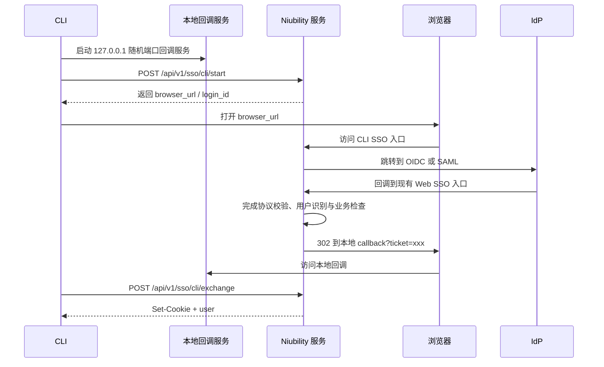

# CLI SSO 登录设计

## 当前状态

本设计对应的核心服务端接口已经存在：

- `POST /api/v1/sso/cli/start`
- `GET /api/v1/sso/cli/login`
- `POST /api/v1/sso/cli/exchange`

CLI 侧也已经支持浏览器 SSO 登录。因此本文档描述的是“已采用的总体模型”，不是纯草案。

## 目标

让 CLI 复用站点现有 OIDC / SAML SSO 能力，同时避免 CLI 直接承担 IdP 协议细节。

## 推荐模型

采用“服务端中转 + 本地回调”的模式：

1. CLI 启动本地临时回调服务
2. CLI 向 Niubility 服务登记一次登录会话
3. 浏览器访问 Niubility 提供的 SSO 入口
4. Niubility 与 IdP 完成 OIDC / SAML 交互
5. Niubility 生成一次性 ticket 并重定向到本地回调
6. CLI 用 ticket 换取会话 Cookie

## 流程图



## 为什么这样设计

- OIDC / SAML 细节都收敛在服务端
- CLI 不需要理解不同 IdP 的协议差异
- Web SSO 与 CLI SSO 共用现有回调入口
- 更利于后续增加审计、风控、账号绑定和错误处理

## 接口说明

### 1. 创建 CLI SSO 会话

`POST /api/v1/sso/cli/start`

请求体：

```json
{
  "callback_url": "http://127.0.0.1:54321/callback"
}
```

典型响应：

```json
{
  "login_id": "abc123",
  "browser_url": "https://niubility.example.com/api/v1/sso/cli/login?request=abc123",
  "expires_in": 300
}
```

### 2. 浏览器发起登录

`GET /api/v1/sso/cli/login?request={login_id}`

服务端根据当前 SSO 配置决定跳转到 OIDC 或 SAML。

### 3. 交换 ticket

`POST /api/v1/sso/cli/exchange`

请求体：

```json
{
  "ticket": "one_time_ticket"
}
```

响应会通过 `Set-Cookie` 写入会话，并返回当前用户信息。

## 约束

- `callback_url` 必须是本地地址
- `login_id` 需要短时有效
- `ticket` 必须一次性消费
- CLI 不应把 IdP 原始协议参数暴露为长期接口契约

## 当前仍需补齐的点

- 更多超时 / 取消 / 重复消费场景验证
- 更完整的用户文档
- 真实部署环境下的运维注意事项沉淀
