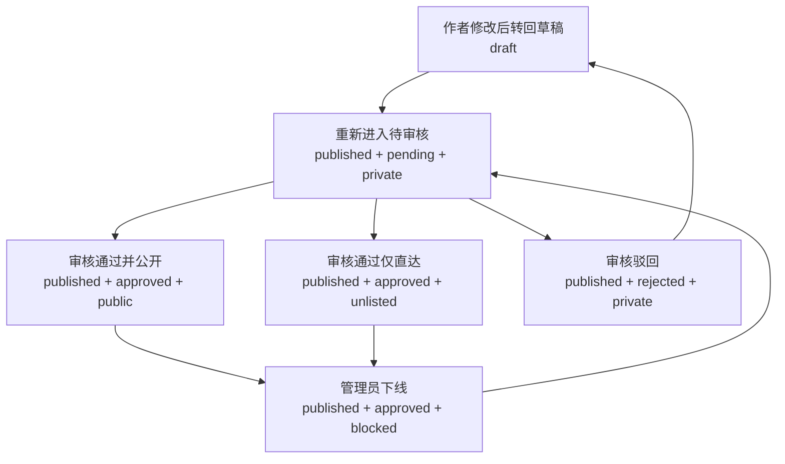

# 内容审核与可见性设计

## 状态

本文档为设计稿，当前仓库尚未完整实现这里描述的审核与可见性机制。

当前系统只有 `draft` / `published` 两种内容状态：

- 公共列表默认只展示 `published`
- `draft` 详情只允许作者或管理员访问
- 作者可在个人设置页查看自己的草稿和已发布内容

这套模型能覆盖“草稿预览”，但不能覆盖以下业务需求：

- 内容已发布但暂不出现在公共列表
- 内容不允许进入公共列表，但仍允许通过直达链接查看
- 内容已过时，需要从公共列表和公共详情都隐藏
- 内容发布后默认进入待审核，而不是立刻公开

## 目标

本设计希望在不打破现有 `Handler -> Service -> Entity` 分层与现有前端结构的前提下，引入一套统一的内容审核与可见性机制。

需要满足：

- 作者发布内容后，默认不自动进入公共列表
- 管理员可以审核内容，并决定是否公开
- 管理员可以将内容设置为“仅直达可见”
- 管理员可以将内容彻底下线，禁止公共详情访问
- 作者始终可以在自己的内容管理页查看自己创建的内容
- 作者在内容未公开时，仍可查看自己的内容详情并继续编辑
- 后台、收藏、点赞、浏览记录、用户主页等链路的可见性规则保持一致

## 设计原则

- 将“创作状态”和“公开可见性”拆开，避免把审核语义强塞进现有 `status`
- 公共列表可见性与公共详情可见性统一收口，避免在多个查询里散落临时判断
- 作者视角、公共访客视角、管理员视角明确分离
- 优先在现有内容接口和后台内容管理页上扩展，而不是新增一套平行内容系统

## 核心模型

建议保留现有 `status` 字段，同时新增审核和可见性字段。

### 现有字段

- `status: draft | published`

`status` 继续表示作者创作流程中的状态：

- `draft`：草稿，仍在编辑，未提交审核
- `published`：作者已提交发布，可进入审核与公开流程

### 新增字段

- `review_status: pending | approved | rejected`
- `visibility: private | unlisted | public | blocked`
- `reviewed_by`：审核人用户 ID，可选
- `reviewed_at`：审核时间，可选
- `review_note`：审核备注，可选

字段含义：

- `review_status`
  - `pending`：待审核
  - `approved`：审核通过
  - `rejected`：审核驳回
- `visibility`
  - `private`：不出现在公共列表，也不允许公共详情访问
  - `unlisted`：不出现在公共列表，但允许通过直达链接访问详情
  - `public`：可进入公共列表，也可访问公共详情
  - `blocked`：已下线，对公共访客完全不可见

## 推荐默认值

### 创建内容

- 新建内容默认：`status = draft`
- 新增字段默认：
  - `review_status = pending`
  - `visibility = private`

说明：

- `draft` 阶段下，审核状态虽然可保留默认值，但不对外生效
- 这样可以避免额外增加更多“空状态”分支

### 作者点击发布

作者将内容从草稿发布时：

- `status` 从 `draft` 变为 `published`
- `review_status` 置为 `pending`
- `visibility` 置为 `private`

结果：

- 作者自己仍可在“我的内容”中查看，也可打开详情
- 管理员可在后台看到待审核内容
- 公共列表和公共详情均不可见

## 状态组合约束

建议采用以下业务约束：

- `status = draft` 时，内容只允许作者和管理员访问
- `status = published` 时，才进入审核与可见性判断
- `review_status = approved` 时，`visibility` 才允许设置为 `public` 或 `unlisted`
- `review_status = rejected` 时，`visibility` 应强制回落为 `private` 或 `blocked`
- `visibility = blocked` 仅用于管理员下线或封禁场景

## 典型业务场景映射

| 场景 | status | review_status | visibility | 结果 |
|---|---|---|---|---|
| 作者草稿 | `draft` | `pending` | `private` | 仅作者/管理员可见 |
| 作者已提交待审核 | `published` | `pending` | `private` | 作者/管理员可见，公共不可见 |
| 审核通过但不进列表 | `published` | `approved` | `unlisted` | 公共列表不可见，直达详情可见 |
| 审核通过并公开 | `published` | `approved` | `public` | 公共列表和详情都可见 |
| 审核驳回 | `published` | `rejected` | `private` | 作者/管理员可见，公共不可见 |
| 内容下线 | `published` | `approved` 或 `rejected` | `blocked` | 公共列表和详情都不可见 |

## 可见性判定

建议在 service 层抽象两类统一规则：

- 公共列表可见
- 公共详情可见

### 公共列表可见

仅满足以下条件时可进入公共列表：

- `status = published`
- `review_status = approved`
- `visibility = public`

### 公共详情可见

仅满足以下条件时允许公共访问详情：

- `status = published`
- `review_status = approved`
- `visibility IN (public, unlisted)`

### 作者可见

当访问者是内容作者时，无论内容是否公开，都允许：

- 在个人设置页的内容列表中看到内容
- 查看内容详情
- 继续编辑内容

但作者是否能直接修改审核状态与公开级别，应由管理员权限控制。

### 管理员可见

管理员始终可以：

- 在后台列表中查看所有内容
- 查看全部内容详情
- 修改审核状态与可见性

## 权限矩阵

| 访问者 | 草稿详情 | 待审核详情 | 仅直达详情 | 公开详情 | 已下线详情 | 公共列表 |
|---|---|---|---|---|---|---|
| 游客 / 普通用户 | 否 | 否 | 是（需知道链接） | 是 | 否 | 仅公开 |
| 作者本人 | 是 | 是 | 是 | 是 | 是 | 不通过公共列表判断，走个人内容管理 |
| 管理员 | 是 | 是 | 是 | 是 | 是 | 后台可查看全部 |

## 后端改动建议

### Entity

扩展 `internal/entity/content.go`：

- 新增 `ContentReviewStatus` 类型与常量
- 新增 `ContentVisibility` 类型与常量
- 在 `Content`、`CreateContentArgs`、`UpdateContentArgs`、`ListContentsArgs` 中补充对应字段

建议字段命名：

- `ReviewStatus ContentReviewStatus`
- `Visibility ContentVisibility`
- `ReviewedBy string`
- `ReviewedAt *time.Time`
- `ReviewNote string`

### Service

扩展 `internal/service/content.go`：

- 在 `CreateContent` 中补默认值
- 在 `UpdateContent` 中处理新字段
- 新增统一可见性条件构造函数，供列表与详情复用
- 将公共列表默认条件从“只看 `status = published`”升级为“只看公共列表可见内容”

建议新增辅助函数：

- `scopePublicListVisible(query *gorm.DB) *gorm.DB`
- `scopePublicDetailVisible(query *gorm.DB) *gorm.DB`
- `canUserAccessContent(user *entity.User, content *entity.Content) bool`

### Handler

扩展 `internal/handler/content.go`：

- `GetContent` 不再只针对 `draft` 做权限判断
- 改为统一调用“作者 / 管理员 / 公共可见性”规则

建议新增管理员审核接口，挂在现有 `/api/v1/admin/*` 下：

- `PATCH /api/v1/admin/contents/:id/moderation`

请求体建议包含：

- `review_status`
- `visibility`
- `review_note`

这样可以避免作者普通编辑接口和管理员审核接口混在一起。

## 前端改动建议

### 类型与 API

需要同步更新：

- `website/src/types/content.ts`
- `website/src/api/content.ts`

### 作者内容管理页

扩展 `website/src/views/settings/contents/index.tsx`：

- 当前只区分 `draft` / `published`
- 后续需要额外展示审核状态和可见性 badge

建议展示：

- 草稿
- 待审核
- 已公开
- 仅直达
- 已驳回
- 已下线

注意：

- “我的内容”页不应复用公共列表可见性过滤
- 作者需要能看到自己所有内容

### 后台内容管理页

扩展 `website/src/views/admin/contents/ContentTable.tsx`：

- 新增审核状态列
- 新增可见性列
- 提供快捷审核操作

建议的后台操作包括：

- 审核通过并公开
- 审核通过但仅直达
- 驳回
- 下线
- 恢复为待审核

### 内容详情页

扩展详情页和 `useContentDetail`：

- 当内容对当前用户不可见时，返回 404
- 作者和管理员继续保留预览与编辑入口

## 受影响的既有链路

当前项目中存在多处以 `contents.status = published` 作为公开条件的逻辑，审核与可见性机制落地后需要统一调整。

重点包括：

- 公共内容列表
- 内容详情
- 用户主页内容列表
- 相关推荐
- 收藏列表
- 点赞列表
- 浏览记录
- 可能依赖 `published` 的统计接口

原则是：

- 面向公共展示的链路，统一使用新的公开可见性规则
- 面向作者自查和后台管理的链路，不应错误套用公共规则

## 推荐实现顺序

### 第一阶段

- 为 `contents` 增加新字段
- 完成后端实体、service、handler 的可见性改造
- 作者发布后默认进入 `published + pending + private`
- 后台可修改审核状态与可见性

### 第二阶段

- 完善后台内容管理页交互
- 在作者内容管理页展示审核状态
- 对收藏、点赞、浏览记录、用户主页等链路做统一联动修正

### 第三阶段

- 根据需要增加审核日志、审核历史、批量审核
- 评估是否需要审核通知、驳回原因展示、重新提审流程

## 状态流转图

## 接口行为示例

### 示例 1：作者发布内容

1. 作者保存草稿
2. 作者点击发布
3. 服务端将内容更新为 `published + pending + private`
4. 后台内容列表出现“待审核”条目
5. 公共列表与公共详情仍不可见

### 示例 2：管理员设置为仅直达可见

1. 管理员审核通过
2. 将内容设为 `approved + unlisted`
3. 内容不进入首页、分类页、用户主页公共列表
4. 已知链接的访问者可打开内容详情

### 示例 3：管理员下线过时内容

1. 管理员将已公开内容设为 `blocked`
2. 内容不再进入任何公共列表
3. 通过旧链接访问详情返回 404
4. 作者和管理员仍可在管理视角进入该内容

## 兼容性与迁移建议

对于历史数据，建议在发布该机制时执行一次兼容迁移：

- 已有 `status = published` 的历史内容默认迁移为：
  - `review_status = approved`
  - `visibility = public`
- 已有 `status = draft` 的历史内容默认迁移为：
  - `review_status = pending`
  - `visibility = private`

这样可以避免老内容在升级后突然消失。

## 风险与注意事项

- 如果只改内容列表而不改收藏、点赞、浏览记录等链路，已下线内容仍可能通过侧边入口暴露
- 如果把审核状态直接并入 `status`，会干扰作者个人内容管理页现有的草稿/已发布体验
- 如果允许作者直接改 `visibility = public`，审核机制会被绕过
- 如果 `unlisted` 与 `blocked` 的详情权限处理不一致，容易出现越权访问或误封

## 当前结论

推荐采用“`status` 保留创作语义，新增 `review_status + visibility` 承载审核与公开控制”的方案。

这套模型可以覆盖：

- 发布后默认待审核
- 不出现在列表但允许直达访问
- 公共详情不可见的下线场景
- 作者自查与管理员审核并存

同时能够尽量少地破坏当前内容编辑、个人设置页和后台内容管理的现有结构。
