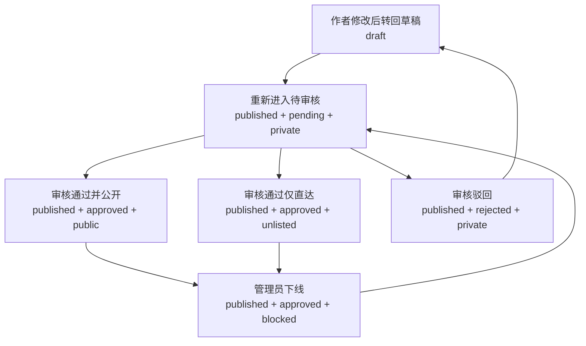

# 内容审核与可见性设计

## 状态

本文档为设计稿，当前仓库已部分实现这里描述的审核与可见性机制，但“已公开内容被修改后的版本策略”等规则仍需要进一步明确。

配套手工验收清单见：[内容审核机制验收 Checklist](/Users/miclle/github/miclle/Niubility/docs/content-moderation-acceptance-checklist.md)

当前系统只有 `draft` / `published` 两种内容状态：

- 公共列表默认只展示 `published`
- `draft` 详情只允许作者或管理员访问
- 作者可在个人设置页查看自己的草稿和已发布内容

这套模型能覆盖“草稿预览”，但不能覆盖以下业务需求：

- 内容已发布但暂不出现在公共列表
- 内容不允许进入公共列表，但仍允许通过直达链接查看
- 内容已过时，需要从公共列表和公共详情都隐藏
- 内容发布后默认进入待审核，而不是立刻公开

## 目标

本设计希望在不打破现有 `Handler -> Service -> Entity` 分层与现有前端结构的前提下，引入一套统一的内容审核与可见性机制。

需要满足：

- 作者发布内容后，默认不自动进入公共列表
- 管理员可以审核内容，并决定是否公开
- 管理员可以将内容设置为“仅直达可见”
- 管理员可以将内容彻底下线，禁止公共详情访问
- 作者始终可以在自己的内容管理页查看自己创建的内容
- 作者在内容未公开时，仍可查看自己的内容详情并继续编辑
- 后台、收藏、点赞、浏览记录、用户主页等链路的可见性规则保持一致

## 设计原则

- 将“创作状态”和“公开可见性”拆开，避免把审核语义强塞进现有 `status`
- 公共列表可见性与公共详情可见性统一收口，避免在多个查询里散落临时判断
- 作者视角、公共访客视角、管理员视角明确分离
- 列表接口按使用场景拆分，避免继续让单个 `/contents` 承担公共、个人主页、个人设置三套语义
- 优先延续现有 `/api/v1` 路由风格和后台内容管理结构，而不是新增一套平行内容系统

## 核心模型

建议保留现有 `status` 字段，同时新增审核和可见性字段。

### 现有字段

- `status: draft | published`

`status` 继续表示作者创作流程中的状态：

- `draft`：草稿，仍在编辑，未提交审核
- `published`：作者已提交发布，可进入审核与公开流程

### 新增字段

- `review_status: pending | approved | rejected`
- `visibility: private | unlisted | public | blocked`
- `reviewed_by`：审核人用户 ID，可选
- `reviewed_at`：审核时间，可选
- `review_note`：审核备注，可选

字段含义：

- `review_status`
  - `pending`：待审核
  - `approved`：审核通过
  - `rejected`：审核驳回
- `visibility`
  - `private`：不出现在公共列表，也不允许公共详情访问
  - `unlisted`：不出现在公共列表，但允许通过直达链接访问详情
  - `public`：可进入公共列表，也可访问公共详情
  - `blocked`：已下线，对公共访客完全不可见

## 推荐默认值

### 创建内容

- 新建内容默认：`status = draft`
- 新增字段默认：
  - `review_status = pending`
  - `visibility = private`

说明：

- `draft` 阶段下，审核状态虽然可保留默认值，但不对外生效
- 这样可以避免额外增加更多“空状态”分支

### 作者点击发布

作者将内容从草稿发布时：

- `status` 从 `draft` 变为 `published`
- `review_status` 置为 `pending`
- `visibility` 置为 `private`

结果：

- 作者自己仍可在“我的内容”中查看，也可打开详情
- 管理员可在后台看到待审核内容
- 公共列表和公共详情均不可见

## 已公开内容修改策略

“已审核通过并公开的内容被作者修改后怎么处理”是这套审核机制里最重要的一条产品规则，因为它会直接影响：

- 公共访客在审核期间看到的是旧版本还是新版本
- 是否需要引入内容版本表
- 作者修改体验是否足够直接
- 管理员审核成本是否会显著上升

这里建议分成两个阶段来处理。

### 第一阶段推荐策略

第一阶段推荐采用当前已经实现的“单记录重新审核”策略：

- 普通作者修改已发布内容的核心展示字段后
- 内容重新进入 `published + pending + private`
- 内容从公共列表中移除
- 公共详情暂时不可访问
- 作者和管理员仍可继续查看与编辑

这里的“核心展示字段”建议包括：

- 标题
- 简介
- 正文
- 封面
- 分类
- 标签
- 主讲人信息
- 附件与媒体内容

不建议把以下轻量字段默认纳入“重新审核触发器”：

- 后台补充的审核备注
- 纯管理字段
- 不影响公开展示的内部标记

这样做的优点是：

- 实现简单，基于现有 `contents` 单表即可完成
- 权限规则清晰，不会出现“一个内容同时有两个公开状态”
- 管理员审核看到的就是作者最新准备发布的版本
- 不需要在第一期就引入版本表、发布快照和回滚逻辑

它的代价也很明确：

- 已公开内容一旦被作者修改，在重新审核完成前会暂时从公共面消失
- 对于高频更新内容，这种“先下线再审核”的体验偏保守

### 为什么第一阶段先不做“双版本并存”

另一种更复杂的方案是：

- 线上继续保留“当前已公开版本”
- 作者在后台编辑“待审核的新版本”
- 审核通过后再把新版本切换成公开版本

这个方案体验更平滑，但复杂度明显更高，需要新增至少一类能力：

- 内容草稿版本表或发布快照表
- 当前公开版本与编辑中版本的双份读取逻辑
- 详情页根据访问者身份决定读哪一个版本
- 审核通过时的版本切换与回滚
- 点赞、评论、收藏、浏览记录与版本切换的兼容策略

如果现在就直接上这套“双版本模型”，会把当前审核改造从“可上线的一期能力”推成一次结构性重构。

因此更推荐：

- 第一阶段先用“单记录重新审核”稳定规则
- 等审核流程跑顺、产品确认确实需要“旧版本继续在线”时，再升级到版本化模型

### 第二阶段可选升级方向

如果后面确认需要“作者修改期间旧公开版本继续可见”，建议在第二阶段升级为双版本模型：

- `contents` 表保留当前公开版本的主记录
- 新增 `content_revisions` 或等价表存储编辑中的待审核版本
- 作者修改已公开内容时，不直接改动公开主记录，而是生成一条待审核 revision
- 管理员审核通过后，再将 revision 提升为新的公开版本

这一阶段建议再单独补一份设计文档，重点回答：

- 评论、点赞、收藏、浏览记录是绑定内容主记录还是绑定具体 revision
- 分类、搜索、相关推荐应读取公开主记录还是待审核 revision
- 管理员驳回 revision 后，旧公开版本是否保持不变
- 作者是否可以同时存在多条待审核 revision

### 当前推荐结论

当前阶段推荐明确采用：

- 普通作者修改已发布内容后，重新进入待审核
- 审核期间不继续保留旧公开版本
- 管理员和作者仍可访问该内容进行审核与编辑

这是当前实现复杂度、权限清晰度和上线速度之间最稳的平衡点。

## 状态组合约束

建议采用以下业务约束：

- `status = draft` 时，内容只允许作者和管理员访问
- `status = published` 时，才进入审核与可见性判断
- `review_status = approved` 时，`visibility` 才允许设置为 `public` 或 `unlisted`
- `review_status = rejected` 时，`visibility` 应强制回落为 `private` 或 `blocked`
- `visibility = blocked` 仅用于管理员下线或封禁场景

## 典型业务场景映射

| 场景 | status | review_status | visibility | 结果 |
|---|---|---|---|---|
| 作者草稿 | `draft` | `pending` | `private` | 仅作者/管理员可见 |
| 作者已提交待审核 | `published` | `pending` | `private` | 作者/管理员可见，公共不可见 |
| 审核通过但不进列表 | `published` | `approved` | `unlisted` | 公共列表不可见，直达详情可见 |
| 审核通过并公开 | `published` | `approved` | `public` | 公共列表和详情都可见 |
| 审核驳回 | `published` | `rejected` | `private` | 作者/管理员可见，公共不可见 |
| 内容下线 | `published` | `approved` 或 `rejected` | `blocked` | 公共列表和详情都不可见 |

## 可见性判定

建议在 service 层抽象两类统一规则：

- 公共列表可见
- 公共详情可见
- 用户主页列表可见
- 当前用户本人内容列表可见

### 公共列表可见

仅满足以下条件时可进入公共列表：

- `status = published`
- `review_status = approved`
- `visibility = public`

### 公共详情可见

仅满足以下条件时允许公共访问详情：

- `status = published`
- `review_status = approved`
- `visibility IN (public, unlisted)`

### 作者可见

当访问者是内容作者时，无论内容是否公开，都允许：

- 在个人设置页的内容列表中看到内容
- 查看内容详情
- 继续编辑内容

但作者是否能直接修改审核状态与公开级别，应由管理员权限控制。

### 管理员可见

管理员始终可以：

- 在后台列表中查看所有内容
- 查看全部内容详情
- 修改审核状态与可见性

## 列表接口设计

建议将现有内容列表按消费场景拆成三类接口，而不是继续让 `/contents` 同时承载公共、个人主页、个人设置三套语义。

### 1. 公共内容列表

- `GET /api/v1/contents`

职责：

- 作为唯一的公共内容列表接口
- 只返回管理员审核通过且允许公开展示的内容

可见性规则：

- `status = published`
- `review_status = approved`
- `visibility = public`

适用页面：

- 首页
- 分类页
- 公共内容流
- 推荐内容列表中面向公开展示的部分

### 2. 用户主页内容列表

- `GET /api/v1/users/:username/contents`

职责：

- 返回某个用户在个人主页上对外展示的内容
- 只服务“别人访问某个用户主页时看到的内容列表”

可见性规则：

- 默认与公共列表一致，只返回 `public`
- `unlisted` 不进入用户主页列表

原因：

- `unlisted` 的语义是“仅直达可见”，而不是“公开出现在个人主页”
- 用户主页属于公开曝光面，不应把仅直达内容自动暴露出来

### 3. 当前用户自己的内容列表

- `GET /api/v1/profile/contents`

职责：

- 返回当前登录用户自己的全部内容
- 用于个人设置页、个人内容管理页

可见性规则：

- 不走公共列表过滤
- 返回当前用户自己的全部内容，包括：
  - `draft`
  - `published + pending + private`
  - `published + approved + unlisted`
  - `published + approved + public`
  - `published + rejected + private`
  - `published + blocked`

### 为什么不建议使用裸 `/<username>/contents`

虽然从 URL 可读性上看 `/<username>/contents` 也能表达用户内容列表，但本项目当前路由体系已经统一在 `/api/v1/*` 下组织。

因此更推荐：

- `GET /api/v1/users/:username/contents`
- `GET /api/v1/profile/contents`

这样做的好处：

- 保持现有 API 分组和版本管理风格一致
- 更容易复用现有鉴权、中间件和 handler 注册方式
- 后续扩展筛选、分页、排序时不会和前端页面路由混淆

## 列表职责边界

三类列表接口的边界建议固定如下：

| 接口 | 面向对象 | 返回范围 |
|---|---|---|
| `GET /api/v1/contents` | 所有人 | 公共可见内容 |
| `GET /api/v1/users/:username/contents` | 访问某个用户主页的访客 | 该用户对外公开展示的内容 |
| `GET /api/v1/profile/contents` | 当前登录用户本人 | 自己的全部内容 |

这样可以避免以下问题：

- 公共列表因为传入 `author_id` 等参数而混入“私人视角”逻辑
- 用户主页和个人设置页误复用同一个过滤规则
- 后续审核状态增加后，一个接口上堆积越来越多例外分支

## 权限矩阵

| 访问者 | 草稿详情 | 待审核详情 | 仅直达详情 | 公开详情 | 已下线详情 | 公共列表 |
|---|---|---|---|---|---|---|
| 游客 / 普通用户 | 否 | 否 | 是（需知道链接） | 是 | 否 | 仅公开 |
| 作者本人 | 是 | 是 | 是 | 是 | 是 | 不通过公共列表判断，走个人内容管理 |
| 管理员 | 是 | 是 | 是 | 是 | 是 | 后台可查看全部 |

## 后端改动建议

### Entity

扩展 `internal/entity/content.go`：

- 新增 `ContentReviewStatus` 类型与常量
- 新增 `ContentVisibility` 类型与常量
- 在 `Content`、`CreateContentArgs`、`UpdateContentArgs`、`ListContentsArgs` 中补充对应字段

建议字段命名：

- `ReviewStatus ContentReviewStatus`
- `Visibility ContentVisibility`
- `ReviewedBy string`
- `ReviewedAt *time.Time`
- `ReviewNote string`

### Service

扩展 `internal/service/content.go`：

- 在 `CreateContent` 中补默认值
- 在 `UpdateContent` 中处理新字段
- 新增统一可见性条件构造函数，供公共列表、用户主页列表、详情复用
- 将公共列表默认条件从“只看 `status = published`”升级为“只看公共列表可见内容”
- 将“当前用户自己的内容列表”从原有通用 `/contents` 查询中拆出

建议不要继续只保留一个 `ListContents` service 方法再通过很多参数分支兼容所有场景。

更推荐拆成语义明确的三个 service 入口：

- `ListPublicContents`
- `ListUserPublicContents`
- `ListMyContents`

底层仍可复用同一个 query builder，但 handler 和 service 入口的职责应当清晰分离。

建议新增辅助函数：

- `scopePublicListVisible(query *gorm.DB) *gorm.DB`
- `scopeUserProfileListVisible(query *gorm.DB) *gorm.DB`
- `scopePublicDetailVisible(query *gorm.DB) *gorm.DB`
- `canUserAccessContent(user *entity.User, content *entity.Content) bool`

### Handler

扩展 `internal/handler/content.go`：

- `GetContent` 不再只针对 `draft` 做权限判断
- 改为统一调用“作者 / 管理员 / 公共可见性”规则

建议的列表接口组织：

- `GET /api/v1/contents`
- `GET /api/v1/users/:username/contents`
- `GET /api/v1/profile/contents`

建议新增管理员审核接口，挂在现有 `/api/v1/admin/*` 下：

- `PATCH /api/v1/admin/contents/:id/moderation`

请求体建议包含：

- `review_status`
- `visibility`
- `review_note`

这样可以避免作者普通编辑接口和管理员审核接口混在一起。

## 前端改动建议

### 类型与 API

需要同步更新：

- `website/src/types/content.ts`
- `website/src/api/content.ts`

建议在前端 API 层明确拆出三个函数，而不是继续用一个 `listContents` 通过不同参数模拟三种语义：

- `listContents()`：公共内容列表
- `listUserContents(username)`：用户主页内容列表
- `listMyContents()`：当前用户自己的内容列表

### 作者内容管理页

扩展 `website/src/views/settings/contents/index.tsx`：

- 当前使用 `/contents + author_id + status` 组合查询
- 后续建议改为使用 `GET /api/v1/profile/contents`
- 后续需要额外展示审核状态和可见性 badge

建议展示：

- 草稿
- 待审核
- 已公开
- 仅直达
- 已驳回
- 已下线

注意：

- “我的内容”页不应复用公共列表或用户主页列表的可见性过滤
- 作者需要能看到自己所有内容

### 用户主页内容页

扩展用户主页内容页时，建议改为使用 `GET /api/v1/users/:username/contents`：

- 只展示该用户已对外公开的内容
- 不展示 `draft`
- 不展示待审核和驳回内容
- 不展示 `unlisted`

### 后台内容管理页

扩展 `website/src/views/admin/contents/ContentTable.tsx`：

- 新增审核状态列
- 新增可见性列
- 提供快捷审核操作

建议的后台操作包括：

- 审核通过并公开
- 审核通过但仅直达
- 驳回
- 下线
- 恢复为待审核

### 内容详情页

扩展详情页和 `useContentDetail`：

- 当内容对当前用户不可见时，返回 404
- 作者和管理员继续保留预览与编辑入口

## 受影响的既有链路

当前项目中存在多处以 `contents.status = published` 作为公开条件的逻辑，审核与可见性机制落地后需要统一调整。

重点包括：

- 公共内容列表
- 用户主页内容列表
- 当前用户自己的内容列表
- 内容详情
- 相关推荐
- 收藏列表
- 点赞列表
- 浏览记录
- 可能依赖 `published` 的统计接口

原则是：

- 面向公共展示的链路，统一使用新的公开可见性规则
- 面向作者自查和后台管理的链路，不应错误套用公共规则

## 推荐实现顺序

### 第一阶段

- 为 `contents` 增加新字段
- 完成后端实体、service、handler 的可见性改造
- 作者发布后默认进入 `published + pending + private`
- 后台可修改审核状态与可见性
- 普通作者修改已公开内容后，重新进入待审核并暂时退出公共面

### 第二阶段

- 完善后台内容管理页交互
- 在作者内容管理页展示审核状态
- 对收藏、点赞、浏览记录、用户主页等链路做统一联动修正
- 根据实际运营反馈，评估是否需要“旧公开版本继续在线”的双版本模型

### 第三阶段

- 根据需要增加审核日志、审核历史、批量审核
- 评估是否需要审核通知、驳回原因展示、重新提审流程
- 如确认需要平滑更新已公开内容，再引入 `content_revisions` 一类版本化结构

## 状态流转图

## 接口行为示例

### 示例 1：作者发布内容

1. 作者保存草稿
2. 作者点击发布
3. 服务端将内容更新为 `published + pending + private`
4. 后台内容列表出现“待审核”条目
5. 公共列表与公共详情仍不可见

### 示例 2：管理员设置为仅直达可见

1. 管理员审核通过
2. 将内容设为 `approved + unlisted`
3. 内容不进入首页、分类页、用户主页公共列表
4. 已知链接的访问者可打开内容详情

### 示例 3：管理员下线过时内容

1. 管理员将已公开内容设为 `blocked`
2. 内容不再进入任何公共列表
3. 通过旧链接访问详情返回 404
4. 作者和管理员仍可在管理视角进入该内容

### 示例 4：作者修改已公开内容

1. 内容当前状态为 `published + approved + public`
2. 普通作者修改标题、正文或附件等公开展示字段
3. 保存后内容自动变为 `published + pending + private`
4. 内容从公共列表和公共详情中暂时移除
5. 管理员重新审核通过后，才能再次进入公共面

## 兼容性与迁移建议

对于历史数据，建议在发布该机制时执行一次兼容迁移：

- 已有 `status = published` 的历史内容默认迁移为：
  - `review_status = approved`
  - `visibility = public`
- 已有 `status = draft` 的历史内容默认迁移为：
  - `review_status = pending`
  - `visibility = private`

这样可以避免老内容在升级后突然消失。

## 风险与注意事项

- 如果只改内容列表而不改收藏、点赞、浏览记录等链路，已下线内容仍可能通过侧边入口暴露
- 如果把审核状态直接并入 `status`，会干扰作者个人内容管理页现有的草稿/已发布体验
- 如果允许作者直接改 `visibility = public`，审核机制会被绕过
- 如果 `unlisted` 与 `blocked` 的详情权限处理不一致，容易出现越权访问或误封

## 当前结论

推荐采用“`status` 保留创作语义，新增 `review_status + visibility` 承载审核与公开控制”的方案。

这套模型可以覆盖：

- 发布后默认待审核
- 不出现在列表但允许直达访问
- 公共详情不可见的下线场景
- 作者自查与管理员审核并存

同时能够尽量少地破坏当前内容编辑、个人设置页和后台内容管理的现有结构。
