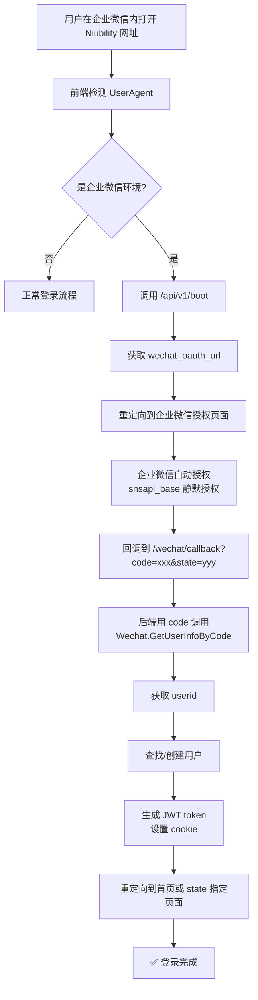
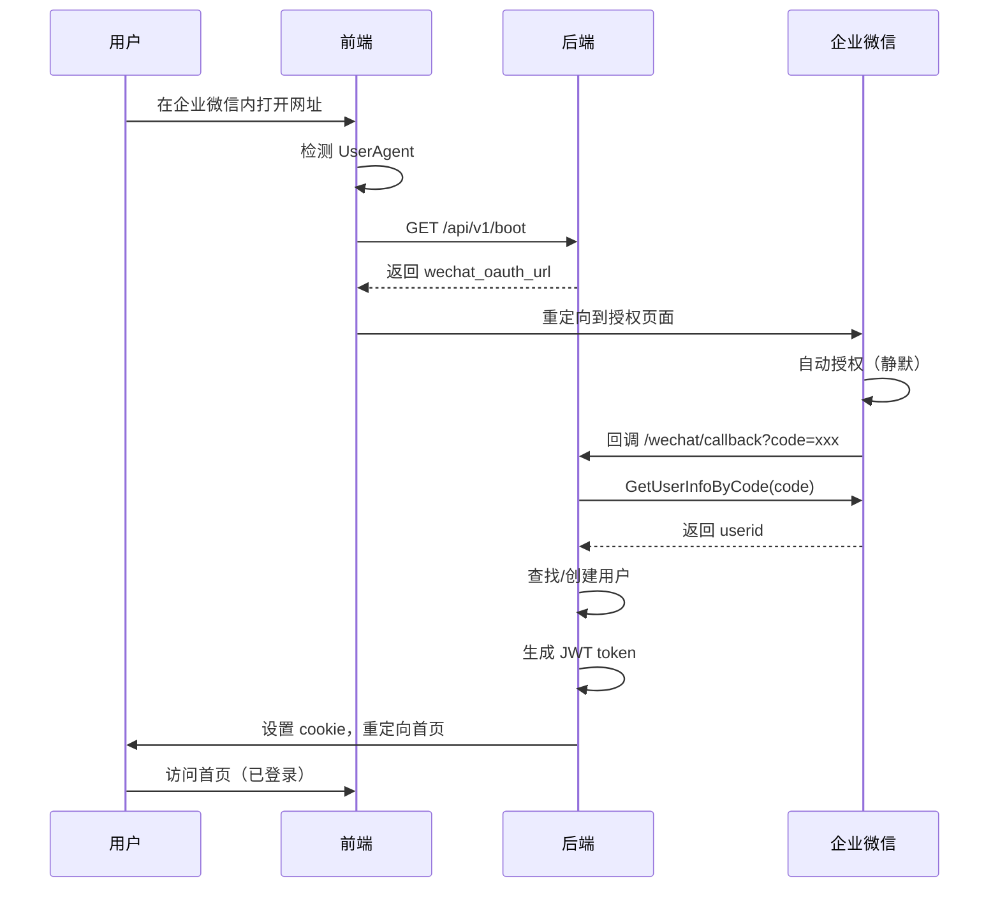

# 企业微信 OAuth2 自动登录

本文档描述如何在 Niubility 平台实现企业微信 OAuth2 网页授权，实现用户在企业微信内打开网址时自动登录。

## 概述

企业微信 OAuth2 网页授权允许从企业微信终端打开的网页获取成员身份信息，免去登录环节。用户在企业微信内点击链接时，系统自动识别用户身份并完成登录。

## 流程图



### 时序图



## 企业微信管理后台配置

### 前提条件

| 条件 | 说明 |
|------|------|
| 企业认证 | 企业必须已通过企业微信认证 |
| ICP 备案 | 域名需完成 ICP 备案 |
| 备案主体 | ICP 备案主体需与企业的企业微信账号主体一致 |

### 配置步骤

#### 1. 登录企业微信管理后台

访问 [企业微信管理后台](https://work.weixin.qq.com/wework_admin/frame)

#### 2. 创建或选择应用

- 进入「应用管理」
- 选择现有自建应用，或点击「创建应用」创建新应用

#### 3. 配置可信域名

1. 在应用设置页面底部找到「可信域名」
2. 点击「设置」
3. 下载域名校验文件（如 `WW_verify_xxx.txt`）
4. 将文件放到域名根目录（通过 `https://your-domain.com/WW_verify_xxx.txt` 可访问）
5. 在可信域名输入框中填写你的域名（如 `niubility.example.com`）
6. 点击验证

#### 4. 配置应用主页（可选但推荐）

设置应用主页为 Niubility 首页地址，如 `https://niubility.example.com`

#### 5. 记录应用信息

配置完成后，记录以下信息用于后端配置：

| 信息 | 说明 | 获取位置 |
|------|------|----------|
| CorpID | 企业 ID | 管理后台「我的企业」→「企业信息」 |
| AgentID | 应用 AgentId | 应用详情页面 |
| Secret | 应用 Secret | 应用详情页面（需管理员权限查看） |

### 配置示例

假设 Niubility 部署在 `https://niubility.company.com`：

| 配置项 | 值 |
|--------|-----|
| 可信域名 | `niubility.company.com` |
| OAuth 回调地址 | `https://niubility.company.com/wechat/callback` |
| 应用主页 | `https://niubility.company.com` |

### 注意事项

- 每个应用**只能配置一个可信域名**
- OAuth2 回调地址的域名必须与可信域名一致
- 域名不支持 IP 地址，必须是已备案的域名
- 域名校验文件必须放在域名根目录且可公开访问

## OAuth2 授权链接构造

### 链接格式

```
https://open.weixin.qq.com/connect/oauth2/authorize?appid=CORPID&redirect_uri=REDIRECT_URI&response_type=code&scope=SCOPE&state=STATE&agentid=AGENTID#wechat_redirect
```

### 参数说明

| 参数 | 必填 | 说明 |
|------|------|------|
| appid | 是 | 企业的 CorpID |
| redirect_uri | 是 | 授权后重定向的回调链接地址，**需使用 urlencode 处理** |
| response_type | 是 | 固定值：`code` |
| scope | 是 | `snsapi_base`（静默授权）或 `snsapi_privateinfo`（手动授权） |
| state | 否 | 重定向后会带上的参数，最长 128 字节 |
| agentid | 是 | 应用 AgentId |
| #wechat_redirect | 是 | 固定值 |

### Scope 说明

| Scope | 说明 |
|-------|------|
| `snsapi_base` | 静默授权，可获取成员的基础信息（UserId），无需用户确认 |
| `snsapi_privateinfo` | 手动授权，可获取成员的详细信息（头像、二维码等敏感信息） |

对于自动登录场景，推荐使用 `snsapi_base` 静默授权。

### 示例链接

```
https://open.weixin.qq.com/connect/oauth2/authorize?appid=wxCorpId&redirect_uri=http%3A%2F%2Fniubility.example.com%2Fwechat%2Fcallback&response_type=code&scope=snsapi_base&state=%2F&agentid=100001#wechat_redirect
```

## API 接口

### 获取访问用户身份

授权回调后，使用 code 调用此接口获取用户身份。

**请求方式**：GET

**请求地址**：`https://qyapi.weixin.qq.com/cgi-bin/auth/getuserinfo?access_token=ACCESS_TOKEN&code=CODE`

**返回示例**：

```json
{
  "errcode": 0,
  "errmsg": "ok",
  "userid": "USERID",
  "user_ticket": "USER_TICKET",
  "expires_in": 7200
}
```

### go-workwx 库调用示例

项目使用 [go-workwx](https://github.com/xen0n/go-workwx) 库：

```go
import "github.com/xen0n/go-workwx/v2"

// 初始化客户端
client := workwx.New(corpID).WithApp(appSecret, agentID)

// 用 code 获取用户身份
info, err := client.GetUserInfoByCode(code)
if err != nil {
    // 处理错误
}

// info.UserID 即为企业微信用户 ID
fmt.Println("User ID:", info.UserID)
```

## 后端实现要点

### 新增路由

| 路由 | 方法 | 说明 |
|------|------|------|
| `/wechat/oauth` | GET | 构造授权链接并重定向 |
| `/wechat/callback` | GET | 处理授权回调 |

### 回调处理逻辑

1. 从 URL 参数获取 `code` 和 `state`
2. 验证 `state` 防止 CSRF 攻击
3. 调用 `Wechat.GetUserInfoByCode(code)` 获取 `userid`
4. 根据 `userid` 查找或创建用户
5. 生成 JWT token 并设置 cookie
6. 重定向到 `state` 指定的页面（默认首页）

### 前端检测企业微信环境

```typescript
function isWeChatWork(): boolean {
  const ua = navigator.userAgent.toLowerCase()
  return ua.includes('wxwork')
}

// 在 App 初始化时检测
if (isWeChatWork() && !isLoggedIn()) {
  // 跳转到企业微信授权
  window.location.href = '/wechat/oauth'
}
```

## 参考链接

- [构造网页授权链接 - 企业微信开发者中心](https://developer.work.weixin.qq.com/document/path/91022)
- [获取访问用户身份 - 企业微信开发者中心](https://developer.work.weixin.qq.com/document/path/91023)
- [OAuth2.0网页授权 - 企业微信开发者中心](https://developer.work.weixin.qq.com/document/path/91335)
- [go-workwx - GitHub](https://github.com/xen0n/go-workwx)
- [go-workwx 文档 - pkg.go.dev](https://pkg.go.dev/github.com/xen0n/go-workwx)

## 常见问题

### Q: 授权后提示"redirect_uri 参数错误"

检查以下项：
1. redirect_uri 是否已 urlencode
2. 域名是否已配置为可信域名
3. 可信域名是否已通过验证

### Q: 只能获取 openid 无法获取 userid

确保：
1. appid 参数使用的是企业的 CorpID
2. 用户在应用的可见范围内
3. agentid 参数已正确填写

### Q: 域名校验失败

1. 确认校验文件放在域名根目录
2. 确认文件可通过 HTTPS 访问
3. 确认文件内容完整未被修改

### Q: 2023年6月20日后创建的应用无法获取手机号/邮箱

这是企业微信的隐私政策变化：
- 新创建的应用调用「读取成员」接口不再返回手机号、邮箱、头像等敏感字段
- 如需这些信息，需要用户在企业微信手机端进行 OAuth2 授权
- 或使用 `snsapi_privateinfo` scope 获取敏感信息（需用户确认）
