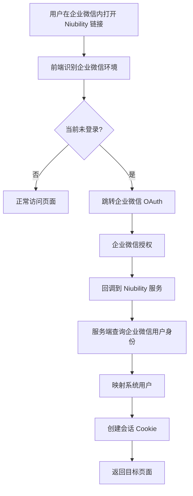

# 企业微信 OAuth 自动登录设计

## 当前状态

本文档描述的是“企业微信网页 OAuth 自动登录”的设计方向，不代表当前代码已经实现。

当前仓库已经实现的是：

- 企业微信配置管理
- 企业微信部门同步
- 企业微信用户同步

当前仓库尚未实现的是：

- 独立的 `/wechat/oauth` 登录入口
- 独立的 `/wechat/callback` 回调处理链路
- 在企业微信内打开网页后的自动登录流程

因此阅读本文档时，请把它视为设计参考，而不是功能说明。

## 目标

当用户在企业微信内打开 Niubility 页面时，系统能够自动识别企业成员身份并完成登录。

## 预期流程

## 设计要点

- 必须与现有登录态和 JWT Cookie 体系兼容
- 必须明确和 OIDC / SAML SSO 的边界
- 必须评估可信域名、备案、部署环境约束
- 必须避免把企业微信 OAuth 设计成与现有认证完全割裂的第二体系

## 与当前能力的关系

当前后台“企业微信”页主要用于同步配置与同步动作，不等同于网页 OAuth 自动登录。

如果后续推进此设计，需要同步评估：

- 登录页交互
- `/api/v1/boot` 返回结构是否需要扩展
- 路由与回调地址
- 用户映射与首次登录策略
- 安全审计与错误处理

## 结论

在代码落地之前，README 和功能清单都不应将“企业微信 OAuth 自动登录”标记为已完成。
